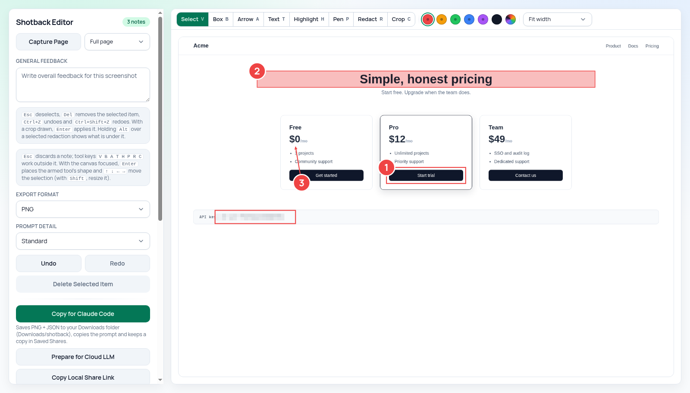

<div align="center">

# Shotback

**Annotated screenshots your coding agent can actually act on.**

Capture a full page, mark what is wrong, redact what is private - then hand an
agent the image _plus_ a machine-readable sidecar with CSS selectors, React
component names and the page's failed requests, so it fixes the right element
instead of guessing at pixels.

[](https://opensource.org/licenses/MIT)
[](https://developer.chrome.com/docs/extensions/)
[](#permissions--privacy)

<picture>
  <source media="(prefers-color-scheme: dark)" srcset="docs/media/hero-dark.png">
  
</picture>

_One capture, three numbered notes, one redacted API key - the editor follows
your browser theme._

</div>

## Why Shotback

A plain screenshot tells an agent _where_ something looks wrong. Shotback also
tells it _what_ that something is: every annotation is mapped back to the live
page as you draw it, so the prompt says `button#pro-cta`, not "the dark button
near the middle". The whole flow is local-first - no account, no server, no
telemetry - and one click ahead of you: the toolbar icon captures immediately.

1. **Capture** the real page state - full page, visible area, or after a 3s countdown for menus and hover states.
2. **Annotate** the exact areas that need attention and attach a note to each.
3. **Redact** anything private; it is pixelated live, exactly as every export will burn it in.
4. **Hand off** - a prompt plus PNG and JSON sidecar for Claude Code, a package for any cloud LLM, a clipboard image for any chat, or a local share link.

## Features

### Capture

- **One click or `Alt+Shift+S`** - the editor opens and captures immediately; no popup, no second click.
- **Full page** via scroll-and-stitch, with an on-page notice while it works - inner-scroller SPAs, sticky headers and smooth-scroll pages handled.
- **Visible area** for a single instant frame, or **Full page after 3s** with an on-page countdown so a menu or hover state survives into the capture.
- **Fit-to-width or 1:1** viewing; a capture never scrolls the page sideways.

### Annotate

- **Five tools** - box, arrow, text, marker-style highlight and freehand pen - each with a numbered pin and an inline comment.
- **A canvas tool palette** with one-key shortcuts (`V B A T H P R C`), six stroke swatches and a custom colour. A drawing tool stays active, so five boxes are five drags.
- **Works without a pointer** - with a tool armed, `Enter` places a shape at the centre of the view, arrow keys move it, `Shift`+arrows resize it.
- **Undo / redo everything** (`Ctrl/Cmd+Z`, `Ctrl/Cmd+Shift+Z`), a comment timeline with per-item remove, and general feedback for page-level notes.
- **Element context, automatically** - each annotation records the CSS selector, visible text and React component chain of the element under it, read from the live tab as you draw.

### Protect

- **Redact (`R`)** pixelates a region live with the same block grid every export burns in - select it and hold `Alt` to peek underneath. The unredacted capture never leaves the editor tab's memory. ([What redaction does and does not protect](SECURITY.md).)
- **Crop (`C`)** narrows every output - image, prompts, sidecar, share - to one region, coordinates re-measured from it. **Clear** restores the full capture; nothing is thrown away.
- **Nothing edits mid-export** - while an export is writing, the canvas freezes, so the file on disk always matches what you saw.

### Hand off

- **Copy for Claude Code** - saves the PNG and a JSON sidecar to `Downloads/shotback/`, keeps a copy in Saved Shares, and puts a prompt on your clipboard that references both by path (Windows paths translated for WSL). [Details below.](#use-with-claude-code)
- **Prepare for Cloud LLM** - downloads the annotated image and copies a structured prompt for any chat-based model.
- **Copy Image** - the annotated PNG straight onto the clipboard.
- **Local share links** - profile-scoped viewer pages (`viewer.html?share=...`), never public URLs.
- **Re-capture (before / after)** - re-shoot a saved share's page and the viewer shows both captures side by side; the prompt tells the agent this capture follows an earlier one.
- **Batch handoff** - tick several saved shares and export them as one folder with a single `batch.json` and one prompt.
- **Prompt detail** (Compact / Standard / Detailed) and **PNG or JPEG** export, both remembered across sessions; Detailed prompts add a Diagnostics block listing the requests the page made and did not get.

## Quick start

### Install from the Chrome Web Store

> Not yet published - the listing link will go here once Shotback is live.
> Until then, build from source below.

### Build from source

```bash
npm install
npm run build
```

Then load it in Chrome:

1. Open `chrome://extensions`
2. Enable **Developer mode**
3. Click **Load unpacked** and select the `dist/` folder

## Usage

1. **Open** the page you want to review and **click the Shotback icon** (or
   press `Alt+Shift+S`; rebind at `chrome://extensions/shortcuts`). The editor
   opens and captures the full page automatically. For anything else, the
   chooser beside **Capture Page** offers **Visible area** and **Full page
   after 3s** (a countdown on the page, for menus and hover states).

2. **Annotate.** Pick a tool on the palette above the capture, or press its
   key:

   | Key | Tool                                                      |
   | --- | --------------------------------------------------------- |
   | `V` | Select - move, resize and comment on existing annotations |
   | `B` | Box                                                       |
   | `A` | Arrow                                                     |
   | `T` | Text                                                      |
   | `H` | Highlight                                                 |
   | `P` | Pen                                                       |
   | `R` | Redact                                                    |
   | `C` | Crop                                                      |

   After each shape the tool stays selected and the new shape's comment box is
   focused - type the note, then `Tab` (or click elsewhere) to keep it, or
   `Esc` to discard it and return to the canvas. Tool keys typed inside a
   comment are text, not shortcuts. Keyboard-only: with a drawing tool armed
   and the canvas focused, `Enter` places the shape, arrows move it,
   `Shift`+arrows resize it. `Del` removes the selected item and
   `Ctrl/Cmd+Z` / `Ctrl/Cmd+Shift+Z` undo and redo any step.

3. **Crop** (optional) - press `C`, drag the region you want to hand over,
   then **Apply crop** (or `Enter`). Every output now covers just that region;
   **Clear** restores the full capture. Annotations are kept in capture
   coordinates and only shifted at export time.

4. **Export.** The sidebar ranks the outputs; **Copy for Claude Code** is the
   filled one - it is the handoff Shotback is built around:

   - **Copy for Claude Code** - PNG + JSON sidecar to `Downloads/shotback/`, prompt on the clipboard, a copy kept in Saved Shares
   - **Prepare for Cloud LLM** - image download + prompt for external LLMs
   - **Copy Local Share Link** - profile-local viewer link on the clipboard
   - **Download Image** / **Copy Image** - the annotated PNG (or JPEG) as a file or on the clipboard

   Destructive actions confirm in place (**Replace capture?**, **Confirm /
   Cancel** on delete) and time out back to safe on their own.

   The **Prompt detail** setting controls how much a prompt carries. **Compact**
   is the numbered comments, general feedback and page URL. **Standard** (the
   default) adds an Environment block (title, viewport, pixel ratio, colour
   scheme, scroller, user agent) and names the element each annotation covers -
   `#pricing > div.card:nth-of-type(2) > button.cta`, plus the React component
   chain on React pages. **Detailed** adds each element's text, classes and
   rect, and a **Diagnostics** block when the page had failing requests:

   ```text
   Diagnostics:
   - Failed requests:
     1. 404 https://example.com/assets/logo.png
     2. 500 https://example.com/api/user
   ```

   Diagnostics are a partial view by construction: only same-origin failures
   (and cross-origin ones that opt in via CORS) are readable, and the browser
   keeps roughly the last 250 resource entries. An absent block means "nothing
   readable failed". The page's own console errors are deliberately **not**
   collected - that would require extension code inside every page's JavaScript
   world on every load, a trade Shotback refuses; see [`SECURITY.md`](SECURITY.md).

## Use with Claude Code

**Copy for Claude Code** writes two files with the same timestamp and copies a
prompt that names both:

```text
Downloads/shotback/cap-1756052403118.png    the annotated capture
Downloads/shotback/cap-1756052403118.json   the same review as data
```

```text
Review this screenshot: /mnt/c/Users/you/Downloads/shotback/cap-1756052403118.png
Machine-readable annotations (selectors, rects, diagnostics): /mnt/c/Users/you/Downloads/shotback/cap-1756052403118.json
...
```

Paste that into your session and the agent reads the annotations instead of
guessing at pixels. The sidecar (`version: 1`) carries, per annotation: the
number drawn on the image, its comment, its `rect` in image px, a
`normalizedRect` (0..1 of the capture) and the element it covers - CSS path,
React component chain, `data-testid`, visible text - plus the capture
environment, failed requests and the image's relative path.

For a repeatable workflow, copy
[`skills/shotback/SKILL.md`](skills/shotback/SKILL.md) into your project's
`.claude/skills/shotback/`. It tells the agent to read the sidecar first, find
the source from selectors and component names, and open the PNG only when the
selectors are ambiguous.

The sidecar is best effort: if it cannot be written, the prompt still copies -
without the machine-readable line - and the status says so.

### Several captures at once

Every saved share has a checkbox. Tick one or more and **Copy batch for Claude
Code** writes them all into one portable folder with a single prompt:

```text
Downloads/shotback/batch-1756052403118/cap-0.png
Downloads/shotback/batch-1756052403118/cap-1.png
Downloads/shotback/batch-1756052403118/batch.json
```

```text
Review these 2 screenshots together.
Machine-readable annotations for every capture (selectors, rects, environment): /mnt/c/Users/you/Downloads/shotback/batch-1756052403118/batch.json

1. https://example.com/pricing - 3 annotations - /mnt/c/Users/you/Downloads/shotback/batch-1756052403118/cap-0.png
2. https://example.com/checkout - 1 annotation - /mnt/c/Users/you/Downloads/shotback/batch-1756052403118/cap-1.png
```

`batch.json` holds a `captures` array of the same per-capture sidecars, each
`imagePath` relative to the folder. The batch is all-or-nothing: if any capture
cannot be written, no prompt is copied and the status names what failed.

## Project structure

```text
src/
  editor/      # annotation editor UI (opened by the toolbar icon)
  viewer/      # local share viewer page
  background.ts, content.ts   # MV3 service worker + content script
  lib/         # pure logic: capture math, rendering, storage, prompts
  types/       # shared TS types
skills/
  shotback/    # companion agent skill to copy into your own project
public/
  manifest.json
tests/         # Vitest unit tests + Playwright e2e (tests/e2e/)
.docs/         # PRD and the todo/doing/done change-folder workflow
```

## Development

| Command            | Description                                                                                                               |
| ------------------ | ------------------------------------------------------------------------------------------------------------------------- |
| `npm run dev`      | Vite dev server                                                                                                           |
| `npm run build`    | Production build to `dist/` (fails if `content.js` is not a self-contained classic script)                                |
| `npm run check`    | The gate: typecheck + lint + unit tests + build                                                                           |
| `npm run test`     | Unit tests (Vitest)                                                                                                       |
| `npm run test:e2e` | Playwright end-to-end suite - drives the real unpacked extension in Chromium (one-time `npx playwright install chromium`) |
| `npm run lint`     | ESLint (`lint:fix` to fix)                                                                                                |
| `npm run format`   | Prettier (`format:check` to verify)                                                                                       |

See [`CONTRIBUTING.md`](CONTRIBUTING.md) for the change workflow.

## Permissions & privacy

Shotback makes **no network requests of its own**. Captures, annotations and
feedback stay in your browser profile; data leaves the device only through an
export you trigger yourself, and every export is a local file write or a
clipboard copy you then paste somewhere manually.

It requests only what full-page capture needs - `activeTab`, `tabs`,
`scripting`, `storage`/`unlimitedStorage`, `downloads`, and `<all_urls>` host
access so it can capture whatever page you are viewing. Page access is used
only while you capture or annotate, never in the background.

- [`PRIVACY.md`](PRIVACY.md) - the plain-language privacy policy
- [`SECURITY.md`](SECURITY.md) - per-permission rationale, the redaction
  guarantee and its limits, and the deliberate non-collection decisions

Local share links are intentionally local: they work only in the browser
profile that created them. For tools that cannot open local links, use
**Prepare for Cloud LLM**.

## Contributing

See [`CONTRIBUTING.md`](CONTRIBUTING.md).

## License

MIT ([`LICENSE`](LICENSE)).
